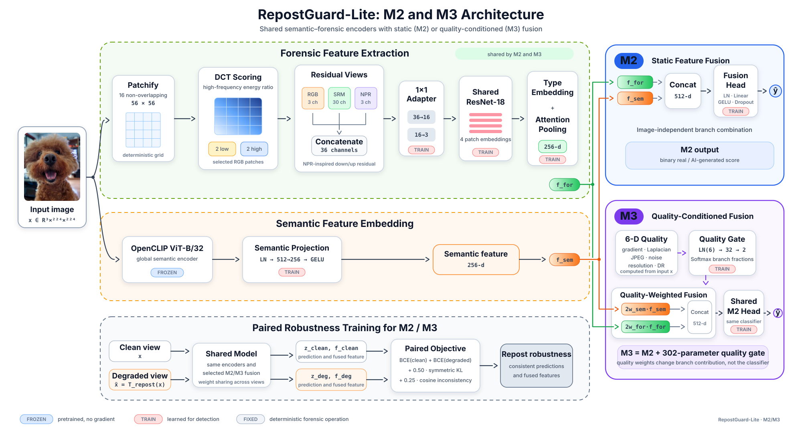

# RepostGuard-Lite

RepostGuard-Lite 是一个面向社交平台转发、编辑和压缩场景的 AIGC 图像二分类研究项目。项目不仅比较单分支 RGB/语义基线，还研究语义特征与频域、残差取证特征的融合，并在严格未见生成器和多阶段扰动下检验泛化能力。

当前主实验版本为 **Community Forensics train-v3**。在完整 4,000 张 strict unseen-generator 测试集上，M2 的 Clean AUROC 为 **0.9308**、Accuracy 为 **85.78%**；六阶段随机组合扰动下 AUROC 为 **0.8525**。因此，在 **train-v3 当前部署目标**下优先选择 M2，并将 B2 作为困难生成器排序能力的补充基线。不过，M3 不能被简单判定为无效：它在数据量和生成器覆盖更受限的 SID-Set 与 train-v2 设置中相对 M2 呈现了一致优势，更合适的定位是具有训练数据规模/多样性依赖的候选融合策略。

> 本仓库默认不包含原始数据和模型权重。复现实验需要按照数据清单重新获取数据，并为每个 checkpoint 保留训练时生成的 `resolved_config.yaml`。

## 核心评测文档

| 文档 | 主 README 中的结论入口 |
|---|---|
| [前端演示与本地推理说明](demo-frontend/README.md) | Vue 3 前端与本地 FastAPI 推理服务的安装、启动、模型契约和测试入口；支持 M2/M3 单图分析、证据展示和鲁棒性实验。 |
| [完整 Reports 文件清单与审计索引](reports/README_reports.md) | 逐项覆盖 reports 下的主报告、CSV/JSON、审计、交付回执和图片资产，并标记当前、版本对比、历史与已知限制。 |
| [Student Distillation 完整产物](student_distillation/README.md) | MobileNetV3-Large Student 的 V1 双教师与 train-v3 第一版蒸馏权重、配置、逐图预测、评测结果及 ONNX/TorchScript 导出入口。 |
| [Robustness Evaluation Summary](reports/summaries/COMMUNITY_FORENSICS_V3_ROBUSTNESS_EVALUATION_SUMMARY.md) | 在 4,000 张 strict unseen-generator 图片上，M2 的 Clean AUROC 为 0.9308，20 个 transformed 条件平均为 0.9163，最坏六阶段条件为 0.8525；文档包含紧凑对比表、可视化、扰动分组和证据边界。 |
| [Error Analysis Note](reports/summaries/COMMUNITY_FORENSICS_V3_ERROR_ANALYSIS_NOTE.md) | M2 的 Clean 错误为 334 FP / 235 FN，六阶段增至 432 FP / 507 FN；文档列出并展示代表性误报和漏报、来源/生成器错误集中，以及 M2、M3、B2 的部署权衡。 |

## 项目概览

### 研究问题

通用 AIGC 检测器很容易学习到文件格式、编码器或已见生成器的捷径。真实平台图片还会经历缩放、裁剪、JPEG、模糊、噪声、颜色调整和多次重编码。项目因此重点回答三个问题：

1. 检测器能否泛化到训练中未出现的精确生成器，甚至未出现的大类生成器？
2. 常规增强、冻结视觉语言特征和取证特征融合，分别对转发鲁棒性有何贡献？
3. M3 的逐样本动态门控是否比 M2 的直接融合带来稳定收益？

### 模型架构

| 模型 | 架构与训练差异 | 总参数量 | 可训练参数量 |
|---|---|---:|---:|
| B0 | ImageNet 预训练 EfficientNet-B0 + Dropout(0.2) + 二分类线性头；clean-only 基线 | 4,008,829 | 4,008,829 |
| B1 | 与 B0 完全相同；仅在训练读取阶段加入对称鲁棒增强 | 4,008,829 | 4,008,829 |
| B2 | 冻结 OpenCLIP ViT-B/32 `laion2b_s34b_b79k` + 512→1 线性头 | 87,849,729 | 513 |
| M2 | 冻结 CLIP 语义分支 + DCT/SRM/NPR 取证分支 + 特征融合分类器 | 99,423,442 | 11,574,226 |
| M3 | M2 + 基于 6 维质量描述的双分支动态门控 | 99,423,744 | 11,574,528 |

M2/M3 的构建受到 [AIDE](https://arxiv.org/abs/2406.19435)（[官方实现](https://github.com/shilinyan99/AIDE)）启发，延续其融合高层语义与低层取证证据的基本思想，但并非对 AIDE 的直接复现。M2 采用共享的轻量取证编码器，并结合 NPR-inspired 残差、注意力 patch 聚合及原图—退化图一致性训练，将研究重点转向有限参数预算下的真实转发鲁棒性；M3 则在 M2 基础上进一步研究质量条件化的动态分支融合。



M2 的取证分支将 224×224 图像划分为 16 个 56×56 patch；DCT 选择 2 个低频和 2 个高频组，并联合 RGB、30 通道 SRM 响应和 3 通道 NPR 残差。特征经 1×1 适配器、从头训练的 ResNet-18、类型嵌入和注意力池化得到 256 维取证表示，再与投影后的 256 维 CLIP 表示融合。

M3 在 M2 上增加 `LayerNorm(6) → Linear(6,32) → GELU → Linear(32,2) → Softmax` 门控。末层零初始化，因此训练初始状态等价于两分支等权融合。M3 只比 M2 多 302 个参数；差异来自融合策略而非容量规模。

#### 参数规模、比赛约束与端侧部署潜力

[TikTok TechJam 2026](https://tiktoktechjam2026.devpost.com/) 题目文档规定：**“Participants must use models with <2B parameters.”** M2/M3 均按完整模型参数量计算，包括冻结的 OpenCLIP 主干，而不是只统计可训练参数：

| 模型 | 总参数量 | 十亿参数表示 | 占 2B 上限比例 | 可训练参数量 |
|---|---:|---:|---:|---:|
| M2 | 99,423,442 | 0.099423B | 4.971% | 11,574,226 |
| M3 | 99,423,744 | 0.099424B | 4.971% | 11,574,528 |

两者都不到 **0.1B**，约为比赛 2B 参数上限的二十分之一，明确满足 `<2B` 要求；M3 引入动态门控后也只比 M2 增加 302 个参数。冻结大部分语义主干且仅训练约 11.57M 参数，也降低了重训和任务适配成本。因此 M2/M3 适合作为端侧轻量化部署的候选起点，可进一步结合 FP16/INT8 量化、结构化剪枝、ONNX/Core ML/TensorRT 导出和算子融合压缩资源开销。需要注意，参数量达标不等同于已经完成端侧部署：正式宣称设备可用前仍需在目标手机或边缘硬件上测量模型文件大小、峰值内存、延迟、吞吐、功耗以及 DCT/SRM/NPR 算子的后端兼容性。

相关实现：

- [`src/repostguard/models/detectors.py`](src/repostguard/models/detectors.py)
- [`src/repostguard/models/forensic.py`](src/repostguard/models/forensic.py)
- [`src/repostguard/models/quality_gate.py`](src/repostguard/models/quality_gate.py)
- [`src/repostguard/losses.py`](src/repostguard/losses.py)

### 训练方法

所有 train-v3 模型独立训练，不从 CIFAKE 或 SID-Set 检测器 checkpoint 续训。公开预训练权重只用于 EfficientNet 或 OpenCLIP 主干。

- 输入：RGB，224×224。
- 训练：3 epochs，AdamW，cosine scheduler，5% warm-up，AMP，gradient clipping=1。
- B0/B1：batch size 128，learning rate `3e-4`。
- B2：batch size 96，learning rate `1e-3`，weight decay `1e-5`。
- M2/M3：batch size 24，gradient accumulation 2，有效 batch size 48，learning rate `2e-4`。
- checkpoint：仅按内部验证集 Clean AUROC 选择。
- 决策阈值：仅按内部验证集 balanced accuracy 冻结；外部测试标签不参与模型或阈值选择。
- 格式去偏：在数据读取过程中统一 RGB、bicubic resize 和同类同参数 JPEG round-trip；训练质量因子随机取 70/80/90/95，评测固定 Q90，不生成第二份图片数据。

M2/M3 的配对目标由 clean BCE、degraded BCE、对称 Bernoulli KL 和余弦特征一致性组成：

```text
L = BCE(clean) + BCE(degraded)
  + 0.50 * symmetric_KL
  + 0.25 * cosine_inconsistency
```

## 数据集与评测协议

### 数据版本演进

| 版本 | 训练数据 | 主要作用 | 后续状态 |
|---|---:|---|---|
| CIFAKE pilot | 10k train + 2k val；32×32；单一 SD1.4 合成来源 | 验证 B0/B1/B2/M2 代码链路 | 只作为低分辨率 pipeline pilot；原始数据与 checkpoint 已清理 |
| SID-Set pilot | 20k train + 4k val；一个不可再分的 AIGI 生成器/风格域 | 引入 M3、读取时格式去偏和严格组合扰动 | 只完成同来源 validation；原始数据与 checkpoint 已清理 |
| Community Forensics train-v1 | 18k，Real/AIGI 各 9k | 首个多来源 Community Forensics 基线 | 当前 `main` 不再提供独立 v1 训练入口 |
| train-v2 | 20k，Real/AIGI 各 10k | 将原 external seen-family 2k 全部提升进训练集 | seen-family 自此禁止作为测试集 |
| train-v3 | 24k，Real/AIGI 各 12k | 新增 GAN 1k、pixel diffusion 1k 及均衡 Real 2k | 当前主训练集 |

train-v3 包含 **921 个精确 AIGI 生成器标签**。新增 AIGI 样本来自 CommunityForensics-Small，尽量扩大 GAN 和 pixel diffusion 的精确小类覆盖；新增真实图片按两个对应的 1,000 张 quota 均衡抽样。由于固定 Small revision 将真实图片来源统一记录为 `N/A`，这里不能进一步声称实现了真实来源类别均衡。train-v3 不是对 v2 的单变量实验：样本数量、生成器覆盖、真实图片抽样配额和抽样种子均发生变化。

### 为什么从 CIFAKE、SID-Set 转向 Community Forensics

官方提交要求保留 CIFAKE 与 SID-Set pilot，但两组实验的作用主要是验证训练、评测和鲁棒性代码链，而不是证明实际部署泛化能力。

#### CIFAKE pilot：低分辨率与单生成器捷径

CIFAKE pilot 使用 10,000 张官方训练图片和 2,000 张官方测试图片作为验证集，Real/AIGI 完全平衡。所有图片均为 **32×32 JPEG**，AIGI 仅来自 **Stable Diffusion 1.4**。将 32×32 图片放大到 224×224 不会恢复已经丢失的纹理、边缘和频谱细节，强模糊、缩放或 JPEG 扰动对这种原生低分辨率图片的影响也远大于常见社交媒体图片。因此模型容易利用单一生成器风格或低分辨率统计捷径，实用性有限。

| 模型 | Clean AUROC | Clean BAcc | 17 扰动平均 AUROC | 17 扰动平均 BAcc | 最坏 AUROC |
|---|---:|---:|---:|---:|---:|
| B0 | **0.9945** | **0.9705** | 0.8638 | 0.7448 | 0.5442 |
| B1 | 0.9929 | 0.9570 | **0.9730** | **0.9043** | **0.9120** |
| B2 | 0.9738 | 0.9220 | 0.9202 | 0.7693 | 0.7688 |
| M2 | 0.9904 | 0.9545 | 0.9641 | 0.8986 | 0.8971 |

Clean AUROC 全部高于 0.97，但 B0 的最坏 AUROC 只有 0.5442。该反差说明同来源 Clean 高分不能代表转发鲁棒性，更不能证明对新生成器有效。M3 尚未在 CIFAKE pilot 阶段实现，因此没有对应结果。

完整 CIFAKE 条件表和运行边界见 [`reports/historical/INITIAL_RESULTS.md`](reports/historical/INITIAL_RESULTS.md)。

#### SID-Set pilot：高分辨率但风格/生成器域不足

SID-Set pilot 使用 20,000 张官方训练图片和 4,000 张官方 validation 图片，只保留 Real 与 full-synthetic 类别。它解决了 CIFAKE 分辨率过低的问题，但本项目可获得的元数据没有提供 full-synthetic 图片的精确生成器身份；所有 AIGI 均被统一记录为 `sid-set-full-synthetic-unspecified`。因此，“单一风格生成器”在这里指 **pilot 中只有一个可审计、不可再分的 AIGI 风格/生成器域**，并非断言 SID-Set 官方全量数据确定只由一个底层模型生成。

这一设置使模型容易拟合训练和 validation 共同的视觉风格、内容分布或生成流程，而不是稳定学习 AIGI 相比真实图片的局部细节和频谱异常。原始数据还存在 Real 几乎全部为 JPEG/MPO、AIGI 全部为 PNG 的严重格式相关性；虽然项目在读取时对两类统一执行 JPEG round-trip，历史压缩痕迹和同来源风格仍无法被完全消除。

| 模型 | Clean AUROC | Clean BAcc | 17 扰动平均 AUROC | 17 扰动平均 BAcc | 最坏 AUROC | 六阶段 AUROC | 六阶段 BAcc |
|---|---:|---:|---:|---:|---:|---:|---:|
| B0 | **0.999950** | **0.997000** | 0.953356 | 0.904941 | 0.469849 | 0.718696 | 0.510750 |
| B1 | 0.999933 | **0.997000** | **0.999559** | **0.992221** | 0.997098 | **0.991335** | **0.937750** |
| B2 | 0.998484 | 0.982250 | 0.996342 | 0.938912 | 0.984164 | 0.936252 | 0.618250 |
| M2 | 0.998046 | 0.979750 | 0.996126 | 0.964882 | 0.988386 | 0.961302 | 0.684500 |
| M3 | 0.999744 | 0.993750 | 0.999402 | 0.987544 | **0.998147** | 0.975617 | 0.739000 |

所有模型的 Clean AUROC 均高于 0.998，B1/M3 的 17 扰动平均 AUROC 也接近 1。这些结果证明了模型能够拟合该封闭数据域，也验证了增强和门控策略在小型、较单一训练域中的作用；但训练和 validation 来自同一 SID-Set 来源，且没有独立精确生成器标签，因此不能将高 AUROC 解释为实际未见生成器泛化能力。

完整 SID-Set 单条件、六阶段与门控审计见 [`reports/historical/SIDSET_B0_B1_B2_M2_M3_SUMMARY.md`](reports/historical/SIDSET_B0_B1_B2_M2_M3_SUMMARY.md)。

#### 论文依据与小型 Community Forensics 构建原则

[Park 与 Owens 的 *Community Forensics: Using Thousands of Generators to Train Fake Image Detectors*（CVPR 2025）](https://openaccess.thecvf.com/content/CVPR2025/html/Park_Community_Forensics_Using_Thousands_of_Generators_to_Train_Fake_Image_CVPR_2025_paper.html)指出，训练数据的生成器多样性是未见生成器泛化的重要限制因素。其控制实验固定训练图片总量、只增加训练生成器数量，检测性能仍会在多种测试生成器架构上提高，对 pixel diffusion 和 GAN 等分布外类别的改善尤其明显。换言之，仅增加同一生成器的图片数量不能替代增加生成器种类。

官方 Community Forensics 包含约 270 万张图片和 4,803 个生成器，完整数据约 1.08 TB；即使 Small 版本仍远超本项目在单 GPU、作业时限和 100 GB Home 配额下可直接训练的规模。因此本项目没有下载并训练全量数据，而是建立可追溯的小型版本：

1. 固定 Hugging Face revision、manifest、随机种子和源定位符，只物化被选中的图片；
2. train-v1 在 18,000 张训练图片中使用 900 个精确 AIGI 生成器，每个生成器 10 张，优先生成器多样性而不是重复堆叠同一来源；
3. train-v2 将 9 个额外精确生成器及其图像并入训练，扩大到 20,000 张；
4. train-v3 再增加 GAN 1,000 张、pixel diffusion 1,000 张及对应 Real 2,000 张，最终为 24,000 张、Real/AIGI 各 12,000 张和 921 个精确 AIGI 生成器；
5. AIGI 取样尽量覆盖更多小类，并在同一 quota 内使各精确生成器贡献尽可能接近；图片级 SHA-256 与 pHash 审计用于避免训练—测试泄漏。

相应的 strict unseen-generator 测试集不只是随机留出图片，而是同时留出训练中未出现的生成器大类和精确身份。当前 4,000 张测试集包含 2,000 张 AIGI 和 2,000 张 Real；AIGI 覆盖 DALL·E、Adobe Firefly、FLUX、Ideogram、Imagen、Midjourney 和 Stable Cascade 等 12 个未训练的商业/其他生成器，Real 则覆盖 COCO、FFHQ、LAION 和 RAISE。它比 CIFAKE/SID-Set 的同来源 validation 更接近“检测未来未知商业生成器并承受平台处理”的实际应用问题，但仍不能代表所有未来生成器和真实流量。

### train-v3 固定测试切片

| 切片 | 角色 | 总数 | Real / AIGI | 与训练集关系 |
|---|---|---:|---:|---|
| Internal validation | checkpoint/阈值选择 | 2,000 | 1,000 / 1,000 | 仅用于验证，不报告为外部泛化 |
| External exact-seen | 外部精确生成器已见测试 | 2,000 | 1,000 / 1,000 | 精确生成器与训练集有交集，图片不重叠 |
| Hard Hourglass | 困难生成器诊断 | 500 | 250 / 250 | v2/v3 下为 exact-seen hard slice |
| Hard DFGAN | 困难生成器诊断 | 500 | 250 / 250 | v2/v3 下为 exact-seen hard slice |
| Hard GALIP | 困难生成器诊断 | 500 | 250 / 250 | v2/v3 下为 exact-seen hard slice |
| Full strict unseen-generator | 主要外部泛化测试 | 4,000 | 2,000 / 2,000 | 12 个精确生成器均未进入训练集 |

strict unseen-generator 的 12 个生成器为 `dalle2`、`dalle3`、`firefly-image2`、`firefly-image3`、`flux-dev`、`flux-schnell`、`ideogramv1`、`ideogramv2`、`imagen3`、`midjourneyv5-2`、`midjourneyv6-1` 和 `stable-cascade`。真实图片由 COCO、FFHQ、LAION、RAISE 各 500 张组成。

测试矩阵含 Clean、17 个单阶段/双阶段扰动，以及两组四阶段共同扰动和一组六阶段随机共同扰动。三组新增组合分别用于模拟平台转发链、编辑后转发链和更严格的随机复合退化。

数据重建所需的仓库 revision、manifest、抽样种子、类别配额、marker 和重下载顺序见：

- [`reports/summaries/COMMUNITY_FORENSICS_TRAIN_V3_DATASET_MANIFEST_SUMMARY.md`](reports/summaries/COMMUNITY_FORENSICS_TRAIN_V3_DATASET_MANIFEST_SUMMARY.md)
- [`Community_Forensics训练与测试集构建方案.md`](../Community_Forensics训练与测试集构建方案.md)

固定数据源 revision：

```text
OwensLab/CommunityForensics-Small@6c539a534c07917307c381f5af4053c6091b5278
OwensLab/CommunityForensics-Eval@7d4a74a88d2cac93b513c0853bf92c260eaceea0
TheKernel01/AIGIBench@f125eabc5ac34a4729d74adc1aa1214540f91947
```

Community Forensics 来源的许可审计结果为 CC-BY-NC-SA-4.0；AIGIBench 应遵循其源仓库许可。数据许可不等同于本仓库代码许可。

## 主要实验结果

以下百分比阈值指标使用内部验证集冻结阈值；AUROC/AP 为排序指标。测试集人为保持 50% AIGI 先验，因此 Accuracy、Precision 和 NPV 不能直接外推到真实平台类别先验。

### 完整 4,000 张 strict unseen-generator：Clean

| 模型 | Accuracy | Precision | Recall | Specificity | F1 | AUROC | AP |
|---|---:|---:|---:|---:|---:|---:|---:|
| B0 | 74.10% | 72.40% | 77.90% | 70.30% | 75.05% | 0.8125 | 0.7882 |
| B1 | 74.33% | 72.18% | 79.15% | 69.50% | 75.51% | 0.8117 | 0.7860 |
| B2 | 69.80% | 74.18% | 60.75% | 78.85% | 66.79% | 0.7707 | 0.7700 |
| **M2** | **85.78%** | **84.09%** | **88.25%** | **83.30%** | **86.12%** | **0.9308** | **0.9136** |
| M3 | 85.35% | 83.96% | 87.40% | 83.30% | 85.64% | 0.9305 | 0.9125 |

### 完整 strict unseen-generator：多阶段扰动

| 模型 | 原 17 扰动均值 | 4-stage A | 4-stage B | 6-stage | 全部 20 transformed 均值 | 6-stage Accuracy |
|---|---:|---:|---:|---:|---:|---:|
| B0 | 0.7582 | 0.7447 | 0.7173 | 0.6597 | 0.7505 | 61.38% |
| B1 | 0.7874 | 0.7872 | 0.7828 | 0.7435 | 0.7850 | 67.03% |
| B2 | 0.7826 | 0.7743 | 0.6910 | 0.6743 | 0.7722 | 58.73% |
| **M2** | **0.9218** | **0.9153** | 0.8877 | **0.8525** | **0.9163** | **76.53%** |
| M3 | 0.9210 | 0.9132 | **0.8888** | 0.8489 | 0.9154 | 76.15% |

B1 与 B0 架构和参数完全相同。在 Clean 上两者几乎相同（0.8117 vs 0.8125），但六阶段 AUROC 从 0.6597 提升至 0.7435，说明训练增强的主要价值体现在复合退化，而不是 Clean 排名。

### External exact-seen 与困难生成器

External exact-seen Clean AUROC：B0 0.7933、B1 0.7999、B2 0.8114、M2 0.8558、M3 0.8578。三个困难生成器的 Clean 等权宏平均 AUROC 由 **B2 取得最高值 0.7261**；五个外部切片的 Clean 等权宏平均同样由 B2 取得最高值 0.7521。

这并不意味着 B2 是综合最优模型。它在完整 strict unseen 上明显弱于 M2/M3，却对 Hourglass、DFGAN、GALIP 的相对排序更稳定，表明当前语义-取证融合模型仍存在特定生成器盲区。三个困难切片共享同一真实负类面板，因此它们是相关诊断切片，不能视为三个统计独立总体。

### train-v2 与 train-v3 公平交集比较

比较仅使用 v2/v3 strict unseen 测试集共同的 2,000 个图像 ID，并固定相同的 21 个条件：

| 模型 | Clean AUROC v2→v3 | 变化 | 非 Clean 均值 v2→v3 | 变化 |
|---|---:|---:|---:|---:|
| B0 | 0.8199→0.8199 | -0.0000 | 0.7480→0.7531 | +0.0050 |
| B1 | 0.8204→0.8152 | -0.0051 | 0.7657→0.7848 | +0.0191 |
| B2 | 0.7632→0.7641 | +0.0009 | 0.7635→0.7680 | +0.0044 |
| M2 | 0.9191→0.9252 | +0.0061 | 0.8994→0.9107 | +0.0112 |
| M3 | 0.9279→0.9261 | -0.0018 | 0.9082→0.9109 | +0.0027 |

五个模型的非 Clean 均值均提高，但只有两个模型的 Clean 点估计提高，且 Clean 置信区间覆盖零。该结果支持“数据扩充普遍改善扰动鲁棒性”，但不能将变化归因于某个单一新增数据因素。值得注意的是，在 train-v2 的同一 strict unseen 交集上，M3 相对 M2 的 Clean AUROC 为 0.9279 vs 0.9191，非 Clean 均值为 0.9082 vs 0.8994；到 train-v3 后两者分别变为 0.9261 vs 0.9252 和 0.9109 vs 0.9107，M3 的相对优势基本收敛。

### M3 动态门控消融

在完整 4,000 张 strict unseen、21 个条件上，对同一 M3 checkpoint 比较四种推理方式：

| 门控方式 | Clean AUROC | Clean Accuracy | 非 Clean AUROC 均值 | 6-stage AUROC |
|---|---:|---:|---:|---:|
| 学习到的逐样本门控 | 0.930533 | 85.35% | 0.915381 | 0.848941 |
| 固定为 Clean 集平均门控 | 0.930264 | 85.43% | **0.915464** | 0.848951 |
| 跨样本随机打乱门控 | 0.930452 | 85.43% | 0.915289 | **0.849029** |
| 固定 0.5 / 0.5 | 0.929502 | 85.40% | 0.914846 | 0.848065 |

学习门控相对固定平均门控的 Clean AUROC 仅高 0.000269，相对随机打乱仅高 0.000081；固定平均门控在非 Clean 均值上反而略高。这个消融只说明：**在扩充后的 train-v3 数据设置及当前 checkpoint 上**，逐样本门控没有带来稳定且具有实际意义的总体增益；它不能外推为“动态门控在所有训练数据设置下均无效”。门控学到的约 58.8% 语义 / 41.2% 取证全局比例可能仍有价值，但使用测试输入分布计算固定平均门控只属于诊断，不是可部署方案。

### M3 门控的跨数据规模解释

较小或生成器覆盖较单一的训练设置提供了与 train-v3 不同的证据：

| 训练设置与同协议测试 | M2 | M3 | M3−M2 |
|---|---:|---:|---:|
| SID-Set validation（历史 pilot）Clean AUROC | 0.998046 | 0.999744 | +0.001698 |
| SID-Set validation（历史 pilot）17 扰动平均 AUROC | 0.996126 | 0.999402 | +0.003276 |
| SID-Set validation（历史 pilot）最坏条件 AUROC | 0.988386 | 0.998147 | +0.009761 |
| SID-Set validation（历史 pilot）六阶段 AUROC | 0.961302 | 0.975617 | +0.014315 |
| SID-Set validation（历史 pilot）六阶段 balanced accuracy | 0.684500 | 0.739000 | +0.054500 |
| train-v2 strict unseen Clean AUROC | 0.9191 | 0.9279 | +0.0088 |
| train-v2 strict unseen 20 个非 Clean 均值 | 0.8994 | 0.9082 | +0.0088 |
| train-v2 4-stage A / 4-stage B / 6-stage AUROC | 0.8968 / 0.8631 / 0.8276 | 0.9087 / 0.8732 / 0.8328 | +0.0119 / +0.0101 / +0.0052 |

因此，更符合全部实验的解释是：**M3 在较小、较单一或分支可靠性差异更明显的数据环境中具有优势；随着 train-v3 增加样本类型和数量，M2 已能学到接近同等有效的融合表示，M3 的逐样本门控边际收益随之缩小。** 这是由跨数据设置结果支持的工作假设，而不是已经完成因果验证的结论。SID-Set 数值来自同一 validation split 的历史 pilot，只能证明该设置内的相对表现，不能当作外部未见生成器泛化证据；同时，SID-Set 和 train-v2 的 M2/M3 来自独立随机训练且均为单 seed，现有提升不能全部归因于新增的 302 个门控参数。最直接的下一步是对 train-v2 M3 checkpoint 复现固定、平均和打乱门控消融，并在受控的数据规模/生成器多样性阶梯上使用共享初始化和多 seed 比较 M2/M3。

完整逐切片、逐扰动和置信区间结果：

- [`reports/summaries/COMMUNITY_FORENSICS_V3_EVALUATION_REPORT.md`](reports/summaries/COMMUNITY_FORENSICS_V3_EVALUATION_REPORT.md)
- [`reports/summaries/COMMUNITY_FORENSICS_TRAIN_V2_V3_UNSEEN_INTERSECTION_COMPARISON.md`](reports/summaries/COMMUNITY_FORENSICS_TRAIN_V2_V3_UNSEEN_INTERSECTION_COMPARISON.md)
- [`reports/summaries/COMMUNITY_FORENSICS_PROJECT_SUMMARY.md`](reports/summaries/COMMUNITY_FORENSICS_PROJECT_SUMMARY.md)
- [`reports/historical/SIDSET_B0_B1_B2_M2_M3_SUMMARY.md`](reports/historical/SIDSET_B0_B1_B2_M2_M3_SUMMARY.md)

## 安装与环境

要求 Python 3.10 或更高版本，推荐 Python 3.11。以下命令均在仓库根目录执行。

### Windows（PowerShell）

```powershell
py -3.11 -m venv .venv
.\.venv\Scripts\python.exe -m pip install --upgrade pip
.\.venv\Scripts\python.exe -m pip install torch==2.5.1 torchvision==0.20.1 --index-url https://download.pytorch.org/whl/cpu
.\.venv\Scripts\python.exe -m pip install -e .
```

NVIDIA CUDA 12.1 环境可将 PyTorch 安装源改为：

```powershell
.\.venv\Scripts\python.exe -m pip install torch==2.5.1 torchvision==0.20.1 --index-url https://download.pytorch.org/whl/cu121
```

### macOS

```bash
python3.11 -m venv .venv
.venv/bin/python -m pip install --upgrade pip
.venv/bin/python -m pip install torch==2.5.1 torchvision==0.20.1
.venv/bin/python -m pip install -e .
```

当前命令行推理接口在 macOS 使用 CPU，尚未开放 MPS 选项。

### Linux

```bash
python3.11 -m venv .venv
.venv/bin/python -m pip install --upgrade pip
.venv/bin/python -m pip install torch==2.5.1 torchvision==0.20.1 --index-url https://download.pytorch.org/whl/cpu
.venv/bin/python -m pip install -e .
```

Linux + NVIDIA CUDA 12.1 可将 PyTorch index URL 改为 `https://download.pytorch.org/whl/cu121`。开发依赖使用：

```bash
.venv/bin/python -m pip install -e ".[dev]"
```

[`environment.yml`](environment.yml) 面向 Python 3.11 + CUDA 12.1 的 NVIDIA/集群环境，并不是 Windows、macOS 和 CPU Linux 的通用环境文件。B0/B1 首次使用可能下载 Torchvision 权重；B2/M2/M3 首次使用可能下载 OpenCLIP 权重。

## 本地目录推理

推理入口递归读取目录中的常见图片格式，为每张可读取图片输出 AIGC 置信分数。必须同时提供同一训练运行的：

```text
<MODEL_DIR>/
├── best.pt
└── resolved_config.yaml
```

程序会严格检查配置摘要，避免 checkpoint 与配置错配。模型权重默认不提交到 Git，请通过安全渠道复制，且不要在仓库中保存访问令牌。

Linux/macOS 示例：

```bash
.venv/bin/python -m repostguard.infer \
  --config /path/to/model/resolved_config.yaml \
  --checkpoint /path/to/model/best.pt \
  --input-dir /path/to/images \
  --output predictions.json \
  --diagnostics diagnostics.json \
  --batch-size 16 \
  --device cpu
```

Windows PowerShell 示例：

```powershell
.\.venv\Scripts\python.exe -m repostguard.infer `
  --config C:\path\to\model\resolved_config.yaml `
  --checkpoint C:\path\to\model\best.pt `
  --input-dir C:\path\to\images `
  --output predictions.json `
  --diagnostics diagnostics.json `
  --batch-size 16 `
  --device cpu
```

Windows/Linux NVIDIA GPU 使用 `--device cuda`。输出为标准 JSON 数组：

```json
[
  {"image_path": "example.jpg", "pred": 0.9342},
  {"image_path": "subdir/image.png", "pred": 0.1276}
]
```

`image_path` 相对于输入目录，`pred` 是 sigmoid 模型分数而不是经部署域校准的真实概率。损坏或无法读取的图片不会写入主输出，详细原因记录在 diagnostics 文件中；结果通过临时文件原子替换。

## 复现实验

### 1. 固定代码、数据和协议

1. 克隆代码并记录 commit SHA。
2. 按数据清单固定 Hugging Face revision、抽样种子和 manifest SHA256。
3. 严格保持内部验证、exact-seen、hard-generator 与 strict unseen 的角色边界。
4. 不使用 external/hard 测试标签调参、选择 checkpoint 或确定阈值。

推荐的数据依赖顺序：

```text
base 24k
  ├─ internal validation / legacy external manifests
  └─ validation-v2 3k
       └─ train-v2 promotion
            ├─ train-v3 additions
            └─ expanded strict-unseen v3
```

完成标记依次为 `COMPLETE`、`VALIDATION_V2_COMPLETE`、`TRAIN_V2_COMPLETE`、`TRAIN_V3_COMPLETE` 和 `EXTERNAL_UNSEEN_V3_COMPLETE`。不要只看到某个下载日志结束就认定完整数据链已完成。

### 2. 训练 B0/B1/B2/M2/M3

train-v3 配置位于 [`configs/community_forensics_v3/`](configs/community_forensics_v3/)。按 B0、B1、B2、M2、M3 顺序独立训练，并保存：

- `best.pt`；
- `resolved_config.yaml`；
- 内部验证集选择指标和冻结阈值；
- Git commit、数据 manifest SHA256、随机种子及运行日志。

当前集群的完整数据构建、训练、鲁棒性评测和报告命令见 [`README_slurm.md`](README_slurm.md)。该文件同时记录 TC2 计算节点约束、资源参数、日志和恢复方式。

重要复现边界：

- 当前 `main` 分支的 Community Forensics 基础训练配置已经指向 train-v2，不能直接重训历史 train-v1。历史 v1 代码谱系需从 commit `76cf99a` 在隔离 worktree 中恢复，并重新审计当前资源参数。
- 基础数据包装脚本在全新重建时可能过早串联模型训练，而 validation-v2/train-v2 尚未完成。进行 clean rebuild 前应使用数据阶段的独立脚本与依赖关系，或先实现 data-only 开关；当前流程不应描述为无条件一键重建。
- Home 配额为 100 GB。选定图片约占 35 GB，Hugging Face 缓存和中间状态还会额外占用空间；下载前先检查配额。
- 若原始文件已删除，不要保留旧 SQLite 状态并假设能够安全续传；manifest、原始对象和完成标记必须一致。

### 3. 固定评测

每个模型应在同一 manifest、同一扰动矩阵和同一冻结阈值下评测：

1. External exact-seen 2k；
2. Hard Hourglass、DFGAN、GALIP 各 500；
3. Full strict unseen-generator 4k；
4. Clean、17 个原始扰动、两组 4-stage 和一组 6-stage；
5. 输出逐图预测、逐条件指标、summary、配置摘要和 manifest 摘要。

跨版本比较必须取图像 ID 和条件的交集。不能直接比较 v2 的 2k strict unseen 与 v3 的完整 4k strict unseen 后宣称训练集变化造成提升。

### 4. 生成报告与核验

报告应至少同时给出 AUROC、AP、Accuracy、Precision、Recall、Specificity、F1、MCC、balanced accuracy 和低 FPR TPR，并标注指标属于排序性能还是冻结阈值操作点。HTML/Markdown 报告必须能够追溯到逐图预测与 manifest，而不能只保留图表。

集群复现实验不得在 Head Node 直接运行 Python、训练、推理或测试；所有计算通过非交互式批处理提交。详情和可复制命令集中在 [`README_slurm.md`](README_slurm.md)。

## 目录结构

```text
configs/                 模型与数据配置
src/repostguard/         数据、模型、损失、训练、评测与推理代码
scripts/                 数据构建、诊断、报告和集群作业入口
student_distillation/    Student 蒸馏权重、评测、逐图预测与移动端导出
reports/README_reports.md 完整报告文件清单与静态审计索引
reports/summaries/       当前数据、模型和实验总结
reports/historical/      CIFAKE、SID-Set 等历史报告
tests/                   静态/单元/集成测试
README_slurm.md           TC2 集群复现与运维说明
```

## 局限性与后续改进

1. **单次随机种子。** 当前核心结论主要来自单次训练；应补充至少 3–5 个种子并报告均值、方差和配对置信区间。
2. **v2→v3 非单因素变化。** 样本量、生成器类别、真实来源配额和 seed 同时变化；下一步应做逐因素增量和配额匹配实验。
3. **未见域仍有限。** strict unseen 只有 12 个精确生成器和 4 个真实来源，不能代表所有商业模型、开放模型、相机和内容域。
4. **困难生成器盲区。** M2/M3 在 Hourglass、DFGAN、GALIP 上明显弱于 B2；需要研究分支特征冲突、源域采样和困难负例训练。
5. **低 FPR 与校准不足。** M2/M3 虽有高 AUROC，但当前完整 unseen 上 TPR@1%FPR 为 0；应使用独立校准集、温度缩放/等距回归和更大规模尾部样本。
6. **格式去偏不完整。** 统一 JPEG round-trip 不能覆盖 EXIF、色彩空间、去噪、截图、社交平台私有编码器和多次上传历史。
7. **M3 门控收益具有数据依赖性。** SID-Set 和 train-v2 上 M3 相对 M2 有一致优势，但 train-v3 的固定/打乱门控消融显示逐样本收益几乎消失。后续应在受控的数据规模与生成器多样性阶梯上使用共享初始化、多 seed 和相同 checkpoint 消融，区分门控本身、随机训练差异与数据覆盖带来的作用；若大规模多样数据下仍无边际收益，再考虑固定融合。
8. **数据重建工程仍需收敛。** 应补充真正的 data-only 入口、端到端 manifest rehydration、内容哈希去重和 COCO/DALL-E 保留集审计。
9. **部署域差异。** 当前测试先验为 50%，分数未经部署域概率校准；生产使用前必须在目标平台重新估计阈值、误报成本和漂移。
10. **端侧性能尚未实测。** M2/M3 的总参数量满足比赛 `<2B` 约束且不到 0.1B，但双分支计算、预处理算子、激活内存和设备后端都会影响实际速度；需要完成量化导出与真机 benchmark 后再确认目标设备等级。

如果有更多时间，优先顺序是：多 seed 重训 → M3 数据规模/多样性阶梯消融 → 低 FPR 校准 → 困难生成器定向诊断 → 因子化数据消融 → 完整数据一键可恢复构建 → 目标平台真实转发链验证。

## 团队成员贡献

当前 Git 历史仅记录一名贡献者：**Liu Shiyuan (`@lsy640`)**。该贡献者完成项目设计、数据下载与协议审计、B0/B1/B2/M2/M3 实现、训练与批处理流程、鲁棒性评测、门控消融、报告生成和本地目录推理入口。

如果项目存在未记录在 Git 历史中的团队成员，应在发布或提交前补充姓名、角色和具体贡献。当前可核验记录对应 solo project。

## 许可与引用

本项目代码采用 [MIT License](LICENSE) 发布，允许在保留版权与许可声明的前提下使用、复制、修改、合并、发布、分发、再许可和销售。数据集、预训练模型、模型权重及第三方依赖仍分别受其原始许可约束；MIT License 不会覆盖或替代这些外部资产的许可要求。

使用 Community Forensics 数据或以其论文结论解释实验设计时，请引用：

```bibtex
@InProceedings{Park_2025_CVPR,
  author    = {Park, Jeongsoo and Owens, Andrew},
  title     = {Community Forensics: Using Thousands of Generators to Train Fake Image Detectors},
  booktitle = {Proceedings of the IEEE/CVF Conference on Computer Vision and Pattern Recognition (CVPR)},
  month     = {June},
  year      = {2025},
  pages     = {8245--8257}
}
```
