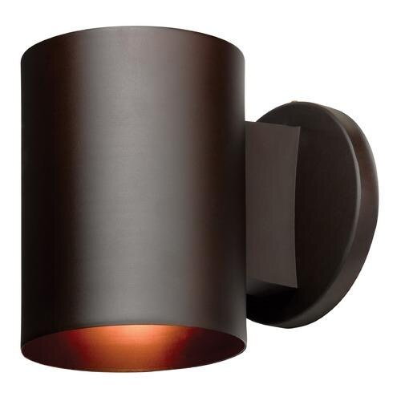
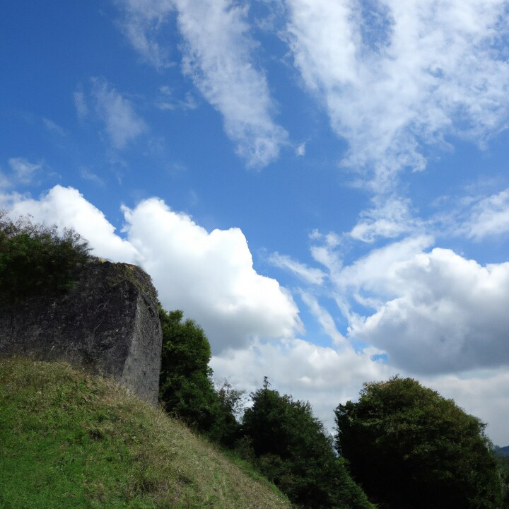
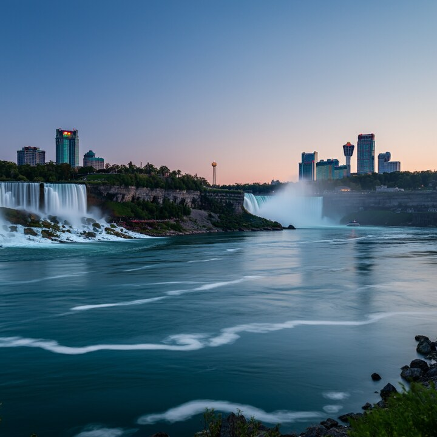

# Community Forensics train-v3 Error Analysis Note

> **English** | [中文](COMMUNITY_FORENSICS_V3_ERROR_ANALYSIS_NOTE_Chinese.md)

## Conclusions

M2, the preferred model under the current train-v3 protocol, attains a Clean AUROC of 0.9308 and an Accuracy of 85.78% on the complete 4,000-image strict unseen-generator test set. Its errors, however, are not uniformly distributed: Clean false positives are concentrated primarily among LAION real images, whereas false negatives are concentrated primarily among Stable Cascade and DALL·E 2 images. The joint six-stage perturbation increases both error types, raising the FP count from 334 to 432 and the FN count from 235 to 507.

M2 is therefore suitable as the current general-purpose baseline, but its `pred` output must not be interpreted as a calibrated probability, and the model should not be deployed directly in settings that require a strictly low false-positive rate. Before deployment, the threshold must be refrozen according to acceptable FP/FN costs using a calibration set that matches the target-platform distribution and is disjoint from this test set.

## Scope of Analysis

| Item | Frozen definition |
|---|---|
| Primary model | M2; the current overall recommendation under train-v3 |
| Comparator models | M3 and B2, used only to characterize architectural and operating-point trade-offs |
| Test set | `unseen_generator_expanded`; 4,000 images, comprising 2,000 Real and 2,000 AIGI images |
| Test role | External strict unseen-generator test; not used for checkpoint, threshold, or model selection |
| Generator coverage | 12 exact generators unseen during training |
| Real-image sources | COCO, FFHQ, LAION, and RAISE, with 500 images from each source |
| Conditions | Clean + 17 original perturbations + 4-stage A + 4-stage B + 6-stage, for 21 conditions in total |
| Frozen M2 threshold | `0.99658203125`, obtained from the internal Clean validation set |
| Decision rule | Classify an image as AIGI if `pred >= threshold`; otherwise classify it as Real |
| Official evaluation job | `32885` |
| Data snapshot | Frozen evaluation artifacts completed on 2026-08-30 |

Test manifest SHA256: `59ca2e4ca966dac9fa4fb55281153f93e5becdd3e25da83bc2dff3fad36126cd`

Perturbation matrix SHA256: `69531f3f7111651808c99f14f89723bf631345878b1cbd0cbe0eee8531dde83c`

All sample-level findings below are derived from frozen per-image predictions. No inference was rerun, and test labels were not used to adjust the threshold.

## Methodology and Data Integrity

This analysis statically joins M2's frozen `predictions.jsonl` with the test manifest by `sample_id`. Within every condition, the same validation-derived threshold is used to reconstruct FP and FN decisions, after which error rates are stratified by Real source and exact AIGI generator. Representative cases are selected from high-AIGI-score FPs, low-AIGI-score FNs, and errors that either persist across conditions or emerge under transformation. Manual inspection is restricted to the original Clean images.

The static integrity checks yielded the following results:

- There are 84,000 predictions, exactly equal to 21 conditions × 4,000 samples.
- All 84,000 `(condition, sample_id)` pairs are unique, and every condition contains 4,000 predictions.
- The manifest contains 4,000 unique `sample_id` values, and bidirectional join coverage between predictions and the manifest is 100%.
- Labels are restricted to 0/1, every `pred` lies in `[0,1]`, and each condition contains 2,000 Real and 2,000 AIGI images.
- The denominators in the stratified FP/FN statistics are always the numbers of samples from the corresponding source or generator within the current condition; the 21 repeated measurements are not treated as independent images.

This Error Analysis Note does not introduce an additional aggregate metric plot. Overall visualizations for Clean and transformed performance are already provided in the companion Robustness Summary; the purpose of the present report is to preserve the exact, auditable relationships among per-sample scores, decisions, sources, and paths, for which tables are more appropriate than a duplicate aggregate figure. Raw data are not committed to Git. The 7 compressed thumbnails embedded below were generated from frozen Clean originals; [`error_analysis_examples.tsv`](../assets/error_analysis/error_analysis_examples.tsv) records the original-image SHA-256, thumbnail SHA-256, and sample lineage.

## Overall Changes in Error Counts

| Condition | AUROC | Accuracy/BA | FP / 2,000 Real | FPR | FN / 2,000 AIGI | FNR | Recall | Specificity |
|---|---:|---:|---:|---:|---:|---:|---:|---:|
| Clean | 0.9308 | 85.78% | 334 | 16.70% | 235 | 11.75% | 88.25% | 83.30% |
| 4-stage A platform repost | 0.9153 | 83.38% | 408 | 20.40% | 257 | 12.85% | 87.15% | 79.60% |
| 4-stage B edit repost | 0.8877 | 79.98% | 327 | 16.35% | 474 | 23.70% | 76.30% | 83.65% |
| 6-stage random composition | 0.8525 | 76.53% | 432 | 21.60% | 507 | 25.35% | 74.65% | 78.40% |

The two four-stage processing pipelines produce distinct error trade-offs. The 4-stage A condition primarily increases false positives on real images. Under 4-stage B, Specificity is slightly higher than under Clean, but Recall decreases by 11.95 percentage points. The six-stage condition degrades performance for both classes.

The paired sample analysis of Clean and six-stage results further demonstrates that the additional errors are not merely repetitions of existing errors:

| Error type | Incorrect under both Clean and six-stage | Incorrect only under Clean | New error under six-stage | Correct under both |
|---|---:|---:|---:|---:|
| False positive (Real) | 240 | 94 | 192 | 1,474 |
| False negative (AIGI) | 185 | 50 | 322 | 1,443 |

### Different Perturbations Shift Errors Toward Different Classes

The original 17 perturbations do not uniformly lower the scores. The following conditions illustrate the most pronounced differences in operating-point direction:

| Condition | FP | FPR | FN | FNR | Principal change relative to Clean |
|---|---:|---:|---:|---:|---|
| Clean | 334 | 16.70% | 235 | 11.75% | Reference operating point |
| Gaussian blur σ=2.0 | 536 | 26.80% | 194 | 9.70% | Scores shift toward AIGI overall, increasing FPs and reducing FNs |
| Crop 0.8 + JPEG Q50 | 483 | 24.15% | 167 | 8.35% | Primarily increases FPs in the same manner |
| Gaussian noise σ=0.02 | 275 | 13.75% | 339 | 16.95% | Scores shift toward Real, reducing FPs and increasing FNs |
| Color jitter 1.2/1.2/1.2 | 291 | 14.55% | 335 | 16.75% | Primarily increases FNs |
| 4-stage B edit repost | 327 | 16.35% | 474 | 23.70% | FPs remain close to Clean, whereas FNs increase substantially |
| 6-stage random composition | 432 | 21.60% | 507 | 25.35% | Increases both error types |

Consequently, a decline in “robustness” cannot be adequately summarized by a single mean Accuracy value. Different processing pipelines move the score distribution in opposing directions, and the false-positive and false-negative costs at a fixed threshold can therefore differ substantially.

## Representative False Positives

The content descriptions in the following table are based on manual inspection of the Clean originals. They serve only to contextualize individual cases and do not constitute causal evidence that the observed visual properties produced the errors. All scores are AIGI sigmoid scores; the parenthetical labels indicate decisions under the frozen threshold.

| ID | Real source and sample | Manual observation | Clean | 4-stage A | 4-stage B | 6-stage |
|---|---|---|---:|---:|---:|---:|
| FP-L | LAION · `cf_external_unseen_v3_real_laion_26ee8390ffc10966` | Single-object product image on a white background, with smooth background and surface textures | 1.0000 (FP) | 1.0000 (FP) | 1.0000 (FP) | 1.0000 (FP) |
| FP-C | COCO · `cf_test_external_unseen_generator_real_696ae99363416c3a` | Indoor photograph of a figurine with shallow depth of field and relatively soft subject boundaries and background | 1.0000 (FP) | 0.9995 (FP) | 1.0000 (FP) | 1.0000 (FP) |
| FP-F | FFHQ · `cf_test_external_unseen_generator_real_7d9a62f010d3fef7` | Close-up portrait with sunglasses, overexposed skin, and high-contrast hair | 0.9995 (FP) | 0.9971 (FP) | 0.9897 (correct) | 0.9922 (correct) |

All images below are **thumbnails of the Clean originals**; select an image to view the larger version stored among the report assets. The thumbnails associate each table identifier with its concrete case and are not claimed to represent the most prevalent error patterns within the corresponding source.

<table>
  <tr>
    <td align="center"><a href="../assets/error_analysis/fp_l_laion.jpg"></a></td>
    <td align="center"><a href="../assets/error_analysis/fp_c_coco.jpg"></a></td>
    <td align="center"><a href="../assets/error_analysis/fp_f_ffhq.jpg"></a></td>
  </tr>
  <tr>
    <td align="center"><strong>FP-L · LAION</strong><br>Clean score 1.0000</td>
    <td align="center"><strong>FP-C · COCO</strong><br>Clean score 1.0000</td>
    <td align="center"><strong>FP-F · FFHQ</strong><br>Clean score 0.9995</td>
  </tr>
</table>

FP-L and FP-C remain high-confidence errors under all four conditions, indicating that these cases are not triggered exclusively by any one additional processing pipeline. FP-F, by contrast, falls below the threshold under 4-stage B and the six-stage condition, demonstrating that post-processing does not invariably increase the AIGI score.

Full manifest-relative paths:

```text
test_external_unseen_v3_additions/real/cf_external_unseen_v3_real_laion_26ee8390ffc10966_00002615.jpeg.jpg
test_external_unseen_generator/real/cf_test_external_unseen_generator_real_696ae99363416c3a_000000093076.jpg.jpg
test_external_unseen_generator/real/cf_test_external_unseen_generator_real_7d9a62f010d3fef7_55660.png.png
```

## Representative False Negatives

| ID | AIGI generator and sample | Manual observation | Clean | 4-stage A | 4-stage B | 6-stage |
|---|---|---|---:|---:|---:|---:|
| FN-F | Firefly Image 2 · `cf_test_external_unseen_generator_aigi_e443b5a1c729d1e4` | Highly detailed historic building facade with a composition resembling architectural photography | 0.7700 (FN) | 0.7759 (FN) | 0.8838 (FN) | 0.9624 (FN) |
| FN-D | DALL·E 2 · `cf_test_external_unseen_generator_aigi_6b5b17c0a5ce4791` | Natural landscape comprising blue sky, clouds, a grassy slope, and woodland | 0.7798 (FN) | 0.8657 (FN) | 0.9263 (FN) | 0.9644 (FN) |
| FN-S | Stable Cascade · `cf_external_unseen_v3_aigi_other_689deeb7f92c7a13` | Seascape and cloud scene with few salient subjects and extensive smooth gradients | 0.8711 (FN) | 0.9570 (FN) | 0.9194 (FN) | 0.9385 (FN) |
| FN-I | Imagen 3 · `cf_external_unseen_v3_aigi_commercial_9b00d2d4e402ab3b` | Long-exposure landscape featuring a waterfall and an urban skyline | 0.9966 (correct) | 0.9980 (correct) | 0.9932 (FN) | 0.7012 (FN) |

The first three images are persistently missed under Clean and all three multistage conditions; FN-I illustrates a false negative induced by the processing pipeline. The displayed images remain thumbnails of the Clean originals and therefore cannot be used to visually infer pixel-level changes under the transformed conditions.

<table>
  <tr>
    <td align="center"><a href="../assets/error_analysis/fn_f_firefly_image2.jpg"></a></td>
    <td align="center"><a href="../assets/error_analysis/fn_d_dalle2.jpg"></a></td>
  </tr>
  <tr>
    <td align="center"><strong>FN-F · Firefly Image 2</strong><br>Clean score 0.7700</td>
    <td align="center"><strong>FN-D · DALL·E 2</strong><br>Clean score 0.7798</td>
  </tr>
  <tr>
    <td align="center"><a href="../assets/error_analysis/fn_s_stable_cascade.jpg"></a></td>
    <td align="center"><a href="../assets/error_analysis/fn_i_imagen3.jpg"></a></td>
  </tr>
  <tr>
    <td align="center"><strong>FN-S · Stable Cascade</strong><br>Clean score 0.8711</td>
    <td align="center"><strong>FN-I · Imagen 3</strong><br>Clean 0.9966; 6-stage 0.7012</td>
  </tr>
</table>

The first three cases remain FNs under Clean and all three multistage processing conditions, representing persistent blind spots for highly photographic architectural or natural scenes. FN-I lies just above the threshold under Clean but falls to 0.7012 after six-stage processing, making it a representative processing-induced false negative.

Full manifest-relative paths:

```text
test_external_unseen_generator/aigi/cf_test_external_unseen_generator_aigi_e443b5a1c729d1e4_00000068_1.jpg.jpg
test_external_unseen_generator/aigi/cf_test_external_unseen_generator_aigi_6b5b17c0a5ce4791_00000550.png.png
test_external_unseen_v3_additions/aigi/cf_external_unseen_v3_aigi_other_689deeb7f92c7a13_000312.png.png
test_external_unseen_v3_additions/aigi/cf_external_unseen_v3_aigi_commercial_9b00d2d4e402ab3b_00000184_0.png.png
```

These observations do not establish that “landscapes,” “smooth regions,” or “photographic composition” cause the errors. Content category, file format, native resolution, generator architecture, data source, and prior processing pipeline all constitute competing explanations that can be distinguished only through controlled comparisons.

## Error Concentration by Slice

### False-Positive Rate by Real-Image Source

| Real source | Clean | 4-stage A | 4-stage B | 6-stage |
|---|---:|---:|---:|---:|
| LAION | **52.40%** | **57.60%** | **45.80%** | **57.80%** |
| COCO | 8.40% | 14.40% | 11.00% | 16.00% |
| FFHQ | 3.80% | 2.00% | 0.20% | 0.40% |
| RAISE | 2.20% | 7.60% | 8.40% | 12.20% |

LAION is the principal source of FPs under all four conditions. This result supports only the descriptive claim that errors are concentrated at the source level. LAION's content distribution, web-image processing history, resolution, and file-format composition may all contribute, and the table alone cannot attribute the effect to a single style.

### False-Negative Rate by AIGI Generator

The following table lists the most difficult generators and those that provide the most informative contrasts. Each generator contributes 166–168 images.

| Exact generator | Clean | 4-stage A | 4-stage B | 6-stage |
|---|---:|---:|---:|---:|
| Stable Cascade | **37.95%** | **47.59%** | **54.22%** | **54.82%** |
| DALL·E 2 | 27.11% | 25.90% | 35.54% | 27.71% |
| Ideogram V2 | 15.06% | 14.46% | 30.72% | 32.53% |
| Imagen 3 | 10.18% | 7.19% | 23.35% | 29.34% |
| Midjourney V5.2 | 8.93% | 7.74% | 23.81% | 27.38% |
| DALL·E 3 | 0.60% | 2.40% | 6.59% | 10.18% |

Stable Cascade is the most consistent concentration of FNs across the four conditions, whereas DALL·E 3 serves as a comparatively easy contrast. The added composite processing affects generators differently; a single aggregate Recall value therefore obscures substantial inter-generator variation.

## Methodological Trade-offs

### 1. Broad Strict-Unseen Generalization Versus Blind Spots on Difficult Generators

M2 substantially outperforms B2 on the full strict-unseen set, but B2 provides better ranking on the three difficult Hourglass, DFGAN, and GALIP slices:

| Objective | B2 | M2 | Interpretation |
|---|---:|---:|---|
| Full strict-unseen Clean AUROC | 0.7707 | **0.9308** | M2 provides stronger broad unseen-generator generalization |
| Hard Hourglass Clean AUROC | **0.7343** | 0.4588 | B2 ranks this difficult generator more reliably |
| Hard DFGAN Clean AUROC | **0.6856** | 0.4614 | M2 Recall is only 12.80% |
| Hard GALIP Clean AUROC | **0.7586** | 0.5460 | Both methods have low Recall at their frozen thresholds |

Under the train-v3 lineage, these difficult generators constitute exact-seen intervention slices and share the same panel of real negatives. They are related difficult diagnostics rather than three independent strict-unseen populations. No single model currently dominates across all test roles.

### 2. Ranking Performance Versus Performance at the Frozen Threshold

B2 has a Clean AUROC of 0.7707, while its mean AUROC over the 20 transformed conditions is slightly higher at 0.7722. Its Accuracy/BA nevertheless falls from 69.80% to 59.83%; under the six-stage condition, Recall is only 26.85% and Specificity is 90.60%. Thus, ranking can be preserved after perturbation even as the score distribution shifts relative to the frozen threshold, with the system exchanging a large increase in FNs for fewer FPs.

AUROC/AP must therefore be reported jointly with Recall, Specificity, and F1 at the frozen threshold. An unchanged AUROC does not justify a claim that deployment performance is unaffected.

### 3. M2 and M3 Fusion Strategies

On the full strict-unseen Clean set, the AUROC values for M2/M3 are 0.9308/0.9305, their Recall values are 88.25%/87.40%, and both attain 83.30% Specificity. Their six-stage AUROC values are 0.8525/0.8489. M2 is marginally superior under the current train-v3 protocol.

M3 is not, however, universally ineffective. It consistently outperforms M2 under the historical SID-Set and train-v2 settings, and its train-v3 external exact-seen AUROC is 0.8578, slightly higher than M2's 0.8558. The available gating ablation establishes only that per-sample dynamic gating does not provide a stable aggregate gain for the current train-v3 checkpoint. A more defensible conclusion is that its benefit depends on training-set scale and generator diversity.

### 4. Low FPR and Score Calibration

M2 and M3 both achieve a Clean AUROC of approximately 0.931, yet both have TPR@1%FPR = 0%; only at 5% FPR do they reach 45.4% and 45.3%, respectively. This falls short of stringent low-false-positive deployment requirements.

For M2 under Clean, the Brier score is 0.3999 and ECE-15 is 0.4395. Of the 2,000 Real images, 37 receive exactly `pred=1.0`, including high-confidence false positives. The frozen threshold is also as high as 0.9966. Accordingly, `pred` should be interpreted as a ranking or confidence score, not as a calibrated “probability that the image was generated by AIGC.”

### 5. Test Prior and Operational Costs

The current test set artificially fixes the AIGI prior at 50%. Accuracy, Precision, NPV, and the optimal threshold all vary with the real-platform class prior and the relative costs of FPs and FNs. The project has not yet specified an acceptable FPR, manual-review capacity, or missed-detection cost; consequently, this report cannot prescribe a final production threshold.

## Recommended Order of Improvements

1. Keep the current strict-unseen and difficult slices frozen, and construct a calibration/development set from new, mutually disjoint target-platform data.
2. Report TPR at target FPR values and paired confidence intervals across multiple preregistered perturbation seeds; do not reselect the threshold on this test set.
3. Introduce LAION-like Real hard negatives and difficult positives from Stable Cascade, DALL·E 2, Hourglass, DFGAN, and GALIP into new training or development data. Use content-, format-, and resolution-matched controlled sampling to distinguish the underlying causes.
4. Train M2 and M3 from shared initializations over multiple seeds, and repeat the fusion ablation along controlled gradients of dataset scale and generator diversity.
5. Explicitly identify `pred` as uncalibrated in the deployment interface, and consider an “uncertain/manual review” interval instead of forcing an immediate binary decision for every image.

## Open Questions

1. What FPR, missed-detection cost, and manual-review capacity are acceptable on the target platform? These constraints—not Accuracy on the current 50/50 test set—should determine the threshold and model choice.
2. Does the concentration of LAION FPs persist after controlling for content category, resolution, format, and prior compression?
3. Are the FNs for Stable Cascade and DALL·E 2 caused by specific content composition, attenuated generator traces, or insufficient training coverage?
4. Do multiple preregistered six-stage random seeds preserve the same source- and generator-level error ranking?
5. Under shared initialization, multiple seeds, and a controlled gradient of dataset diversity, when does M3 gating consistently outperform M2?

## Scope of Evidence

- Each current model has only one training seed; small M2/M3 differences do not establish statistical significance.
- The representative images were manually selected as extreme or persistent error cases. They are not a random sample and do not estimate the prevalence of error types.
- Source- and generator-stratified results are descriptive statistics; each source still confounds content, format, resolution, and processing-history differences.
- The six-stage condition uses only one fixed seed and cannot be treated as the probability distribution of all platform processing pipelines.
- Test labels were not used to select the model, checkpoint, or threshold, and these test images should not subsequently be promoted directly into training as hard examples.
- Raw data are not committed to Git; sample paths can be resolved locally only after the data have been redownloaded according to the manifest.

## Traceable Evidence

```text
data/manifests/community_forensics_test_external_unseen_generator_v3_expanded.csv
outputs/community_forensics_v3_robustness_v2/m2/unseen_generator_expanded/
├── COMPLETE
├── metrics_by_transform.csv
├── predictions.jsonl
├── run_card.json
└── summary.json

outputs/community_forensics_v3_robustness_v2/m3/unseen_generator_expanded/
reports/summaries/COMMUNITY_FORENSICS_V3_EVALUATION_REPORT.md
reports/summaries/COMMUNITY_FORENSICS_V3_ROBUSTNESS_EVALUATION_SUMMARY.md
reports/summaries/COMMUNITY_FORENSICS_TRAIN_V2_V3_UNSEEN_INTERSECTION_COMPARISON.md
```

For the complete Clean and transformed summary, see [`COMMUNITY_FORENSICS_V3_ROBUSTNESS_EVALUATION_SUMMARY.md`](COMMUNITY_FORENSICS_V3_ROBUSTNESS_EVALUATION_SUMMARY.md).
