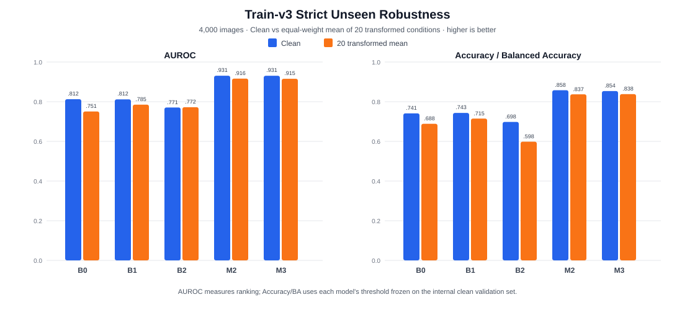

# Community Forensics train-v3 Robustness Evaluation Summary

## 结论

在完整 4,000 张 strict unseen-generator 测试集上，**M2 是当前最均衡的鲁棒模型**：Clean AUROC 为 0.9308，20 个 transformed 条件的等权平均 AUROC 为 0.9163，最坏条件仍为 0.8525；冻结阈值下 Clean Accuracy 为 85.78%，transformed 平均 Accuracy 为 83.70%。M3 与 M2 基本持平，并在 transformed 平均 Accuracy 上略高 0.11 个百分点；该点差不应在单 seed 下解释为统计优势。

B1 相比同架构 B0 显著缩小了 Clean 到 transformed 的性能下降，说明类别对称增强改善了组合处理鲁棒性。B2 的 transformed 平均 AUROC 没有下降，但 Accuracy/BA 明显下降，说明其主要问题是冻结阈值迁移，而不是排序能力全面失效。

## 评测协议

| 项目 | 冻结定义 |
|---|---|
| 训练版本 | Community Forensics train-v3，24,000 张，Real/AIGI 各 12,000 张 |
| 测试角色 | External strict unseen-generator；不参与 checkpoint、阈值或模型选择 |
| 测试规模 | 4,000 张，Real/AIGI 各 2,000 张 |
| AIGI 覆盖 | 12 个训练未见精确生成器；Commercial/Other 大类同样未进入训练 |
| Real 覆盖 | COCO、FFHQ、LAION、RAISE，各 500 张 |
| 条件 | 1 Clean + 17 个原始扰动 + 2 个四阶段组合 + 1 个六阶段随机组合，共 21 个 |
| checkpoint | 每个模型仅按内部 validation Clean AUROC 选择 |
| 阈值 | 每个模型仅按内部 validation Clean balanced accuracy 冻结 |
| 聚合 | transformed mean 对 20 个非 Clean 条件等权平均；每个条件使用同一 4,000 张图片 |

测试 manifest SHA256：`59ca2e4ca966dac9fa4fb55281153f93e5becdd3e25da83bc2dff3fad36126cd`

扰动矩阵 SHA256：`69531f3f7111651808c99f14f89723bf631345878b1cbd0cbe0eee8531dde83c`
正式评测作业：`32885`，终态已记录为完成。

## Clean 与 transformed 紧凑对比

由于测试集类别完全平衡，Accuracy 与 balanced accuracy 数值相同。`Δ` 定义为 transformed mean 减去 Clean；负数表示退化。

| 模型 | Clean AUROC | 20 transformed mean AUROC | Δ AUROC | 最坏 transformed AUROC | Clean Acc./BA | Transformed mean Acc./BA |
|---|---:|---:|---:|---:|---:|---:|
| B0 | 0.8125 | 0.7505 | -0.0620 | 0.4846 | 74.10% | 68.85% |
| B1 | 0.8117 | 0.7850 | -0.0267 | 0.6665 | 74.33% | 71.48% |
| B2 | 0.7707 | 0.7722 | +0.0015 | 0.6743 | 69.80% | 59.83% |
| **M2** | **0.9308** | **0.9163** | **-0.0145** | **0.8525** | **85.78%** | 83.70% |
| M3 | 0.9305 | 0.9154 | -0.0152 | 0.8489 | 85.35% | **83.81%** |



## 分扰动组 AUROC

| 模型 | Clean | 原 17 扰动均值 | 4-stage A | 4-stage B | 6-stage | 全部 20 transformed 均值 |
|---|---:|---:|---:|---:|---:|---:|
| B0 | 0.8125 | 0.7582 | 0.7447 | 0.7173 | 0.6597 | 0.7505 |
| B1 | 0.8117 | 0.7874 | 0.7872 | 0.7828 | 0.7435 | 0.7850 |
| B2 | 0.7707 | 0.7826 | 0.7743 | 0.6910 | 0.6743 | 0.7722 |
| **M2** | **0.9308** | **0.9218** | **0.9153** | 0.8877 | **0.8525** | **0.9163** |
| M3 | 0.9305 | 0.9210 | 0.9132 | **0.8888** | 0.8489 | 0.9154 |

原 17 个扰动包括：

- JPEG：Q90、Q70、Q50、Q30；
- Gaussian blur：σ=0.5、1.0、2.0；
- resize：bicubic 0.5、bilinear 0.25；
- Gaussian noise：σ=0.02、0.05、0.1；
- color jitter：0.8/0.8/0.8 与 1.2/1.2/1.2；
- center crop：ratio 0.8；
- 两阶段组合：resize 0.5 + JPEG Q70、crop 0.8 + JPEG Q50。

新增三组严格条件为：

- 4-stage A platform repost：crop 0.85 → bicubic resize 0.5 → blur σ=1.0 → JPEG Q50；
- 4-stage B edit repost：color jitter 1.15/1.15/0.85 → bilinear resize 0.5 → noise σ=0.05 → JPEG Q50；
- 6-stage random composition：六类扰动全部执行，每类强度按训练范围独立随机采样。

## 模型级解释

### B0 与 B1

B0 的 Clean AUROC 为 0.8125，但 transformed mean 降至 0.7505，最坏 Gaussian noise σ=0.1 仅为 0.4846。B1 不增加任何参数，只改变训练增强；其 transformed mean 提升到 0.7850，最坏 AUROC 提升到 0.6665，六阶段 AUROC 从 0.6597 提升到 0.7435。因此 B1/B0 是增强改善复合扰动鲁棒性的直接消融证据。

### B2

B2 的 transformed mean AUROC 比 Clean 高 0.0015，但 transformed mean Accuracy/BA 从 69.80% 降到 59.83%。这不是“扰动提高了部署性能”，而是冻结阈值与分数分布发生偏移；AUROC 排序与固定操作点必须联合报告。

### M2 与 M3

M2/M3 在 Clean、原 17 扰动和新增复合条件上均明显领先三种基线。M2 获得最高 Clean、transformed mean、4-stage A、6-stage 和最坏 AUROC；M3 在 4-stage B AUROC 与 transformed mean Accuracy/BA 上略高。差值很小且只有一个训练 seed，因此当前部署选择优先 M2，M3 继续作为数据规模依赖的门控候选，而不是宣称任一模型统计显著优于另一个。

## 主要失败模式与部署含义

1. **连续处理链仍最困难。** M2/M3 的最坏条件都是六阶段组合；B0/B1 的最坏条件是强 Gaussian noise。
2. **阈值迁移不能由 AUROC替代。** B2 是最明显示例；部署必须在独立目标域校准阈值。
3. **低 FPR 尾部仍不足。** M2/M3 在当前 full unseen Clean 上的 TPR@1%FPR 为 0，虽然整体 AUROC 很高，但不满足严格低误报场景。
4. **模型胜负依赖目标。** 综合 strict-unseen 排序与固定阈值优先 M2；困难 Hourglass/DFGAN/GALIP 的生成器级排序仍由 B2 更强。

## 证据边界

- 结果来自单个训练 seed，模型间小差异不构成统计显著性证明。
- transformed mean 对预定义 20 个条件等权，不代表未来真实平台处理链的概率分布。
- 测试先验为 50% AIGI；Accuracy、Precision 与 NPV 不能直接迁移到真实平台先验。
- strict unseen 只覆盖 12 个生成器与 4 个真实来源，不代表所有未来生成器和相机域。
- 所有阈值均来自内部 clean validation；外部测试标签没有用于选择 checkpoint 或阈值。

## 可追溯产物

每个模型的正式结构化结果位于：

```text
outputs/community_forensics_v3_robustness_v2/<model>/unseen_generator_expanded/
├── COMPLETE
├── metrics_by_transform.csv
├── predictions.jsonl
├── run_card.json
└── summary.json
```

更完整的五切片报告见 [`COMMUNITY_FORENSICS_V3_EVALUATION_REPORT.md`](COMMUNITY_FORENSICS_V3_EVALUATION_REPORT.md)。
